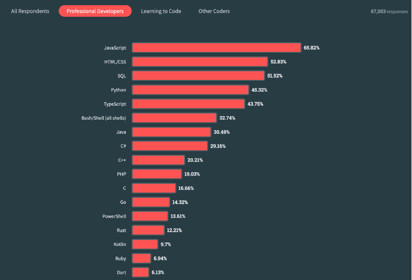

# Intro til Rust

🦀

---

# Agenda

- Intro på ca. 30 min
- Workshop

---

# Installer rustup!

- Versjonsmanager av verktøy til språket
- https://rustup.rs/
- Følg og fullfør installasjonen (f.eks. på Windows kreves MSVC++-verktøy, XCode tools (LLVM) på macOS)

---

# Hva er Rust?

- Programmeringsspråk, håper du visste det...
- Lansert versjon 1.0 i 2015, påbegynt allerede i 2006, men var svært annerledes
- Statisk typesystem, a la C#/Kotlin/Java/C/ osv., men ikke Python/JS osv.
- Kompilerer til én executable/binary, krever ikke VM/runtime som Java/Kotlin/C#/Go
- Ingen garbage collection 🚮

---

# Egenskaper

- Ytelse (Performance)
  - Ingen garbage collection
  - Ingen runtime
- Pålitelighet (Reliability)
  - Sterkt typesystem
  - Minnesikkerhet og trådsikkerhet
- Produktivitet (Productivity)
  - God dokumentasjon
  - Gode feilmeldinger og tooling

---

**Hva brukes det til?**


---

**Brukes det egentlig av noen?**
Brukes mer enn Kotlin!


---

# Forskjellen på Rust og andre språk

- Garbage-collecta språk (C#, F#, Haskell, Java, Kotlin, JS, Python, Dart, Swift, Go, osv.)
  - Mindre å tenke på
  - Tregere
- Manuell minnehåndtering (malloc/free) (C, C++, Zig, Assembly)
  - Mer å tenke på
  - Betydelig raskere og mindre ressurskrevende
- Rust
  - Litt mer å tenke på, men like raskt som manuelt håndtert

---

# Ingen garbage collection?

- Garbage-collection betyr at språket/runtimet håndterer allokering og deallokering av minne for deg
- `var x = new Thing();` i C# allokerer for deg og deallokerer etter hvert når du slutter å bruke `x`
- `var x = Thing();` i Rust gjør det samme for deg, men umiddelbart etter du ikke bruker `x`, og du slipper overhead med at det skjer i runtime, siden dette håndteres ved kompilering

---

# Hvordan ser syntaksen ut?

Java:

```java
Thing thing = new Thing();
```

C:

```c
Thing* thing = create_thing();
if (thing == NULL) return NULL;
// Do stuff, then deallocate
free(thing);
```

---

# Hvordan ser syntaksen ut?

```rust
// On the stack
let thing = Thing();
// On the heap
let thing_on_the_heap = Box::new(Thing());
```

---

# Hvordan er typesystemet?

- Ingen `null`
- Ingen exceptions
- Immutable by default
- Eksplisitt fremfor implisitt
- Typeinferens
- Generics
- Traits
- Algebraiske datatyper
- Lifetimes, eller _hvor lenge lever en verdi_

---

# Algebraiske datatyper?

- I ca alle andre språk vi bruker støttes kun _product types_
- En klasse kan ha felt `read` og `write` som er bools, som da tilsvarer fire tilstander
- Hva er greia når `read` er `false` og `write` er `true`?
- Da tyr man til enums, `ReadOnly`, `ReadAndWrite`, og `NoAccess`
- Hvor og hva er _sum types_?

---

# Sum types

- Summen av alle tilstandene en type kan ha, ikke produktet
- bools har to typer, så to felt med bools blir 2\*2=4 tilstander
- Enumen tidligere har tre tilstander, `ReadOnly`, `ReadAndWrite`, og `NoAccess`
- Men sum-typer kan også bære med seg data

---

# Endelig litt Rust!

```rust
enum OptionallyCarriesString {
    Nothing,
    Some(String)
}
```

Tilstanden er alltid kun én av de to. Enten `Nothing` eller `Some("123456")`

```rust
struct Person {
    age: u8,
    name: String
}
```

---

# Må vi lage en sånn type hver gang vi ville skrevet `null` ellers?

Generics!

```rust
enum Option<T> {
    None,
    Some(T)
}
```

Tilsvarer `null` i andre språk, men er ikke en default-verdi _alt_ kan ha

---

# Rust primitive data types

- `bool` som er `true` eller `false`
- Talltyper:
  - `i32`: heltall som er 32 bits, signed, fra `-2147483648` til `2147483647`
  - `u32`: heltall som er 32 bits, unsigned, fra `0` til `4294967295`
  - Flyttall: `f32`, `f64`
  - Resten av helltallene: `u8`, `i8`, `u16`, `i16`, `u64`, `i64`, `u128`, `i128`
  - `usize` og `isize` som er antall bits i arkitekturen på CPU (64-bit)
- Unit: `()`, den tomme typen, ligner på `void` i andre språk

---

# Feilhåndtering

Ingen exceptions?? :weary: Neida

```rust
enum Result<T,E> {
    Ok(T),
    Err(E)
}

let result: Result<GoodValue, Error> = something_that_can_fail();
```

---

# Hvordan sjekker vi disse verdiene?

- `match` er en mye bedre versjon av `switch`/`case`

```rust
let maybe_something: Option<i32> = get_value();
match maybe_something {
    Some(x) => do_stuff_with(x),
    None => handle_missing_value(),
}
let maybe_error: Result<i32, Error> = something_that_can_fail();
match maybe_error {
    Ok(x) => do_stuff_with_ok_value(x),
    Err(e) => handle_error_somehow(e),
}
```

---

# Kan gjøre mye mer

```rust
let maybe_restaurant = Some(Restaurant {
    name: String::from("Hos Thea"),
    address: Address {
        street: String::from("Strandveien 123"),
        postal_code: 9006,
    },
});
match maybe_restaurant {
    Some(Restaurant {
        adress: Address {
            street,
            postal_code: 9000..=9299,
        },
        name,
        ..
    }) => println!("{name} ligger i {street} i Tromsø"),
    _ => /* Do nothing */,
}
```

---

# Funksjoner

```rust
fn process_something(data: Data) -> Output {
    let output = process_data(data, some_options_or_something);
    // Implicitly returns the last non-semicolon terminated value
    output

    // Can also be written explicitly with
    // return output;
}
```

---

# Generiske funksjoner

Når du vil abstrahere over forskjellige datatyper

```rust
fn do_stuff<T>(t: T) {
    // But what can you really do with a totally generic type you know nothing about?
}
```

---

## Traits

- Som interfaces i andre språk. Mer lik typeclasses fra Haskell

```rust
trait Bark {
    fn bark() -> String;
}
impl Bark for Dog {
    fn bark() -> String {
        String::from("woof")
    }
}
impl Bark for Fox {
    fn bark() -> String {
        String::from("Wa-pa-pa-pa-pa-pa-pow!")
    }
}
```

---

# Generics med trait bounds

Nå kan vi skrive en funksjon som printer noe ved å bruke traiten som sir om noe kan printes, `Display`

```rust
fn print_it_my_way<T: Display>(t: T) {
    println!("WOW LOOK AT THIS: {t}!");
}
```

---

# Hello world

```rust
fn main() {
    println!("Hello, world!");
}
```

Men hva er `!` i `println!` der?

---

# Makroer

- Makroer er kode som genererer kode
- `println!("Hello, world!)` utvides til koden som trengs for å printe noe
- Veldig nyttig for å slippe duplikasjon, kompleks kode, boilerplate
- Kan tillate nye patterns og ting som DSL (domain-specific language), men pass på å ikke misbruke
- F.eks. `dbg!(x)` der `x` er en variabel med 3 vil printe `3` med ekstrainfo slik:

```
[src/main.rs:2] x = 3
```

---

# Mer om `dbg!`

`dbg!(3)` utvides til følgende så du slipper å skrive det!

```rust
match 3 {
  tmp => {
    {
      $crate::io::_eprint(builtin #format_args("[{}:{}] {} = {:#?}","",0u32,"x", &tmp));
    };
    tmp
  }
}
```

---

# Eierskap

- Alle verdier i Rust har en eier
- Når eieren ikke lenger bruker verdien vil den deallokeres (droppes)
- Eieren av en verdi kan låne ut tilgang til verdien via referanser, eller gi fra seg eierskapet
- Lånene kan enten være lesereferanse eller skrive- og lesereferanse, og det kan kun enten være den ene eller den aktive på et gitt tidspunkt
- En som låner en referanse kan dele ut nye lån, så lenge de varer kortere enn man selv låner for

---

# Referanser

- Anta vi har en type `T`. Har vi en verdi av typen `T` tilsier det at vi er eieren
- For å låne ut en referanse til `T` skriver vi `&T`, og typen kalles også `&T`. Dette er en lesereferanse. Ingen andre kan skrive til verdien så lenge referansen lever.
- For å låne ut en skrive-(og lese)-referanse skriver vi `&mut T`, og som navnet tilsier har vi _mutable_ tilgang, også mer korrekt kalt _exclusive access_ Ingen andre kan lese eller skrive til verdien så lenge denne eksisterer.

---

## Eksempel

Si vi har en dagbok:

```rust
struct Diary {
    notes: String,
}

let mut diary = Diary { notes: String::new() };

fn lend_diary(diary: &Diary) {
    println!("{}", diary.notes)
}

fn write_diary(diary: &mut Diary) {
    diary.notes.push_str("Omg you wouldn't believe what happened today")
}
```

---

# Eksempel del 2

Vi kan fint både låne ut lesereferanser og ekslusive referanser, hvorfor?

```rust
lend_diary(&diary);
lend_diary(&diary);
lend_diary(&diary);
write_diary(&mut diary);
lend_diary(&diary);
```

Pga. lifetimes. Alle referansene vi lager og låner ut varer kun til funksjonene returnerer.

---

# Eksempel del 3

Å lagre notatene på en eller annen plass ville gitt en feil når vi lager referansen. F.eks.

```rust
fn store_notes(diary: &Diary) {
    // Anta vi har storage: &mut &String en eller annen plass
    // *storage gir oss mulighet til å modifisere det &mut refererer til, nemlig &String
    *storage = &diary.notes;
}
```

Å kalle denne funksjonen fra der vi har dagboken ville gitt feilmelding på at referansen vi lager til dagboken kanskje lever for kort, så man må være tydelig med om `storage` sin referanse eller dagboken sin referanse skal leve lengst.

---

# Lifetimes

- En del av typesystemet, skrives som en del av typesignaturen som en generisk type, siden det er noe kompilatoren finner ut av
- `&T` skrives eksplisitt som `&'noe T`, der `'noe` er navnet på lifetimen til referansen. Navnet har ingenting å si, så det er ofte vanlig å bruke `'a`, `'b`, osv.
- F.eks. kan vi skrive signaturen til `read_diary` eksplisitt med:

```rust
fn read_diary<'a>(diary: &'a Diary)
```

- Rust har lifetime elision som vil si at i 9/10 tilfeller skjønner kompilatoren hvilke lifetimes referanser bør ha og bruker de

---

# Moduler og namespaces

```rust
// also equivalent to placing the contents in `diary_module.rs`
// and writing `mod diary_module;` here insteead
mod diary_module {
  struct Diary;
  struct SomethingElse;
}

// we can use items within modules using ::
fn read_diary(diary: &diary_module::Diary) {
}

// or import them using `use`
use diary_module::Diary;
// Or import multiple values
use diary_module::{Diary, SomethingElse};
```

---

# Bruker også `::` for å gå inni typer

Kan brukes til å hente ut alle ting som er _statiske_

```rust
enum MinType {
  MinVariant
}

impl MinType {
  fn min_metode() {
  }
}

// Kan nåes med
MinType::MinVariant;
MinType::min_metode();
```

---

# Mye mer å lære, men her er noen tips på vei

- VS Code med rust-analyzer eller IntelliJ/Clion med Rust-pluginen
- Bok fra A til Z: https://doc.rust-lang.org/book/
- Dokumentasjon til standardbiblioteket: https://std.rs
